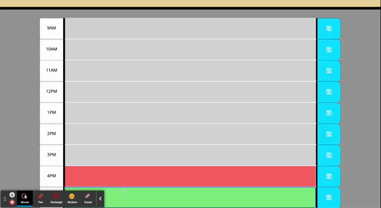

# 5. Day-Planner Challange

A Day Planner made using JQuery, Moment JS and CSS Bootstrap.

Deployed page link: https://mrcaseyrobison.github.io/5.Day-Planner/

- Initial HTML & CSS elements were already pre-fabricated.
- Minor styling tweaks in CSS (Background color, fonts, thicker inner borders in the planner)
- I used CSS Bootstrap with pre-defined class & ID tags to create the time blocks from 9am - 5pm (09:00 hours to 17:00 hours)
- I used Moment JS to display the current date at the top of the page.
- Local storage works!

